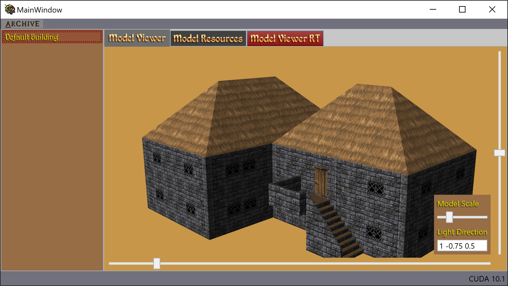

The Elder Scrolls .NET
======================
WPF/RT Viewer of the Daggerfall Models _(only one model ATM)_

### Requirements
- Visual Studio 2019 [Community](https://visualstudio.microsoft.com/vs/community)
- Full [Daggerfall Game from Bethesda](https://elderscrolls.bethesda.net/en/daggerfall)
- [OptiX 6.5](https://developer.nvidia.com/designworks/optix/download)
- [CUDA 10.1](https://developer.nvidia.com/cuda-toolkit-archive) I'll try to update this to 11 soon I guess, might work with 11, but there are some library names hard coded in the `OptixCore.Library` that would need to be updated (at least)
- That _should_ do it.
- A git Submodule version may show up one day.

#### Notes
Once you have installed Daggerfall you will need to set the Area2Path in the application config file
```xml
<applicationSettings>
    <wpfDagger.Properties.Settings>
        <setting name="Arena2Path" serializeAs="String">
            <value>B:\Bethesda.net Launcher\games\TES Daggerfall\DF\DAGGER\ARENA2</value>
        </setting>
    </wpfDagger.Properties.Settings>
</applicationSettings>
```